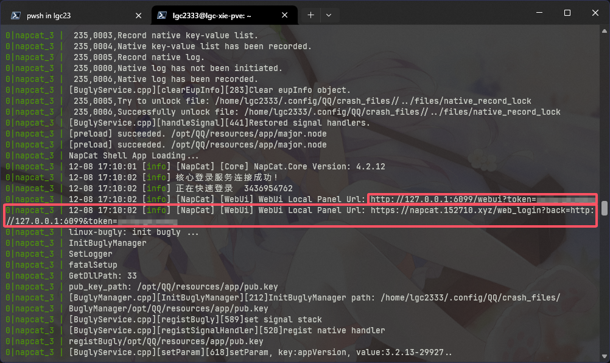
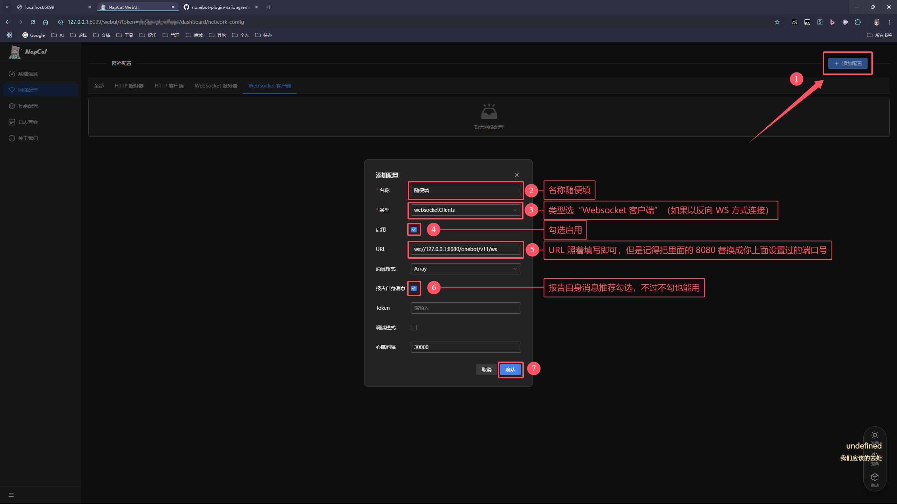

<!-- markdownlint-disable MD028 MD033 -->

# 从零开始的面向小白的插件部署教程

## 1. 部署 Python 环境

如果你已经拥有自己心仪的 Python 环境，检查你的 Python 版本是否大于等于 3.9 即可

> [!WARNING]
> 不建议下载最新的 Python 版本，因为可能有第三方库还没来得及适配最新版的 Python，导致出现插件依赖相关问题
>
> 在下面的教程中，我们会下载最新版本的前一个大版本

> [!NOTE]
> 本人不喜欢 Conda 给系统上它的默认环境，所以下面不介绍如何使用 Conda
>
> 基于 Anaconda 虚拟环境可以参考：[nailongremove 部署教程](https://y0b8o2qjszv.feishu.cn/docx/GJ7ndJU2Aod6jtxpukXcA6etnyb)

### 1.1. Windows

访问 Python 官网 <https://www.python.org>，鼠标移到 Downloads 上，之后点击 All Releases


之后向下滚动到 Looking for a specific release 下寻找要下载的版本

在上张图片中可以看到当前最新的 Python 版本为 3.13.0，所以我们寻找最新的 3.12 版本下载


点进去之后向下滚找到 Windows installer (64-bit) 下载（现在的电脑一般是 X86 架构 CPU 加 64 位操作系统，如果是其他架构请自行下载对应架构的安装包）


下载完成后打开安装包<sub><sup>（忽略这个是 3.11 版的安装界面）</sup></sub>，**一定要记得勾选 Add python.exe to PATH！！！** 然后直接点击 Install Now 安装即可

如果要更改安装路径可以选择 Customize Installation 后自行更改后继续安装，注意安装路径最好不要有中文


打开终端（Win + R 输入 `powershell` 回车），输入以下内容回车验证 Python 是否安装成功

```shell
python -V
```


### 1.2. Linux

在 Linux 环境下我们使用 [pyenv](https://github.com/pyenv/pyenv) 来管理系统中的 Python

在命令行中输入以下命令回车安装：

```shell
curl https://pyenv.run | bash
```

然后执行下面的命令来向 shell 配置中写入 pyenv 的环境变量相关配置（如果你使用的不是 bash，请自行替换文件名）

```shell
echo 'export PYENV_ROOT="$HOME/.pyenv"' >> ~/.bashrc
echo '[[ -d $PYENV_ROOT/bin ]] && export PATH="$PYENV_ROOT/bin:$PATH"' >> ~/.bashrc
echo 'eval "$(pyenv init -)"' >> ~/.bashrc
```

执行以下命令重载 shell 配置（其他 shell 请自行修改文件名）

```shell
source ~/.bashrc
```

现在你应该可以使用 pyenv 了

```shell
pyenv -v
```


按照 [Wiki 中 Suggested build environment 部分](https://github.com/pyenv/pyenv/wiki#suggested-build-environment) 根据你所使用的发行版安装好所需依赖，如下面是 Ubuntu / Debian / Linux Mint 发行版所需执行的命令


装好依赖后开始安装 Python，执行下面的命令安装 Python 3.12

```shell
pyenv install 3.12
```

稍等片刻安装好后，设置 Python 3.12 为 shell 中的默认 Python

```shell
pyenv global 3.12
```

验证是否安装成功

```shell
python -V
```

<sub><sup>（忽略这里的 Python 版本为 3.11）</sup></sub>


## 2. 部署 NoneBot

在这里我们使用我开发的 [nb-cli-plugin-bootstrap](https://github.com/lgc-NB2Dev/nb-cli-plugin-bootstrap) 来创建 NoneBot2 项目

先找一个心仪的目录来放置你的 NoneBot2 项目，注意路径中最好不要存在中文

Windows 用户在资源管理器中单击地址栏后输入 `powershell` 回车即可打开命令行<sub><sup>（忽略我输入的是 pwsh）</sup></sub>，如图


首先安装 `nb-cli` 与 `nb-cli-plugin-bootstrap`，输入以下命令回车

```shell
pip install nb-cli nb-cli-plugin-bootstrap
```

安装完成后输入以下内容回车开始创建项目

```shell
nb bs
```

项目名称为创建项目后的文件夹名称

选择适配器时，使用键盘上下键将左侧箭头指向 OneBot V11 适配器（如果你要对接野生 QQ 机器人），之后 **按一下空格** 选中该适配器  
**这步一定要记得按空格选中你要安装的适配器！！！选中后左侧圆圈会变成实心，该项也会亮起，请注意区分！！**


剩余选项根据你的喜好填写即可，如果不想自定义可以一直回车使用默认设置  
建议修改一下端口号避免由于端口被占用导致 NoneBot 无法启动

部分设置后续可以通过 `.env.prod` 文件修改，使用任意文本编辑器打开查看详细信息  
之后的插件配置也需要填写到此文件中

安装完成后如图


## 3. 安装插件

接上一步操作，在命令行中输入下面的命令将工作目录切换到你创建好的项目目录中  
<sub><sup>或者在资源管理器中打开项目文件夹后单击地址栏输入 `powershell` 回车打开新的命令行窗口</sup></sub>

```shell
cd 项目名
```

之后输入下面的命令来安装本插件

```shell
nb plugin install nonebot-plugin-nailongremove
```

> [!NOTE]
> 上面方式安装的插件仅支持以 CPU 推理 AI 模型，  
> 配置以 GPU 运行的环境会非常麻烦，仅推荐专业用户操作，相关信息请查看 README

安装过程如图

  


## 4. 启动 NoneBot

在命令行中输入以下命令并回车启动 NoneBot

```shell
nb run
```

Windows 下也可以直接双击 `#启动.bat`  
Linux 下也可以使用 `./#run.sh`

~~**NoneBot，启动！**~~

启动完成并且没问题的话，应该像下面这样，没有任何报错


## 5. 配置野生 QQ 机器人协议端连接 NoneBot

如果你想对接其他聊天平台（在第二步时安装了其他的适配器），请略过这节并自行查看对应平台适配器的文档，见 [适配器商店](https://nonebot.dev/store/adapters)

请在以下协议实现中选择**其中一个**你心仪的开始使用即可

### 5.1. Lagrange.OneBot

第三方的 NTQQ 协议实现

打开 Lagrange 存储库的 Actions 页，筛选 Lagrange.OneBot Build 的 Workflow，然后筛选 master 分支（[可以点这里](https://github.com/LagrangeDev/Lagrange.Core/actions/workflows/Lagrange.OneBot-build.yml?query=branch%3Amaster)）

（这里是手动打开的步骤，从上面链接点进去的可以不用看）  


点击右侧列表中第一个打钩项目右侧的标题，然后向下滚找到 Artifacts 列表，之后找到对应你机器系统架构的构建产物下载  
如果下面的文件列表无法点击下载，请登录 GitHub 账号

<p>
<details>

<summary>判断你机器架构的方法（摘自 <a href="https://x.none.bot/before/install_lagrange">NoneBotX 社区文档</a>）（点击展开）</summary>

- 如果你要在一般的个人电脑或者装有 Windows Server 的服务器上运行，请优先尝试 `win-x64` 版本；
- 如果你要在装有 Linux 发行版的个人电脑/服务器上运行，请优先尝试 `linux-x64` 版本；
- 如果你要在“树莓派”或智能手机等 ARM 设备上运行，请优先尝试 `linux-arm64` 版本，若无法运行则再尝试 `linux-arm` 版本；
- 如果你要在 Apple M 系列芯片的电脑上运行，请选择 `osx-arm64` 版本，否则请选择 `osx-amd64` 版本。

</details>
</p>

例：Windows、X86 架构 CPU、64 位系统（一般的家用电脑和 Windows 云服务器都是这样的）下载这个：  


下载完成后打开压缩包，找一个你喜欢的目录将里面的可执行文件解压出来，之后双击运行，看到下图样的提示后先直接把它关掉


打开同目录下 Lagrange 生成的 `appsettings.json`

把 `Uin` 后的 `0` 替换为你 Bot 的 QQ 号，密码不动留空使用扫码登录，如下图


接着修改，让它能以反向 Websocket 连接到 NoneBot，参考下图，记得把下面 `Port` 后的 `8080` 修改成你之前配置的端口号


之后再次运行 Lagrange，手机登录 Bot 的 QQ 扫码登录


之后你应该可以看到你的 NoneBot 提示已经连接到 Bot 并可以正常接受消息了


### 5.2. NapCat

基于 QQNT 本体的协议实现，需要安装 QQNT 客户端，但可以以无头（无图形界面）方式启动

下载安装步骤参见 [NapCat 文档](https://napcat.napneko.icu/guide/start-install)

安装好后修改其配置使其以反向 Websocket 连接到 NoneBot 即可，以下两种方式选择 **其中一种** 即可

#### 使用 WebUI 修改配置

从 NapCat 控制台中找到 WebUI 的地址，如下图框住的部分（两个都是，只是界面设计不同），复制进浏览器打开



之后依照下方图中步骤添加网络配置即可



#### 手动修改配置文件

找到 NapCat 的配置文件，参考下面配置，记得把下面的 `8080` 修改成你之前配置的端口号

```jsonc
{
  // ...
  "wsReverse": {
    "enable": true,
    "urls": ["ws://127.0.0.1:8080/onebot/v11/ws"]
  }
  // ...
}
```

## 6. 后续

### 6.1. 重新启动

无需再做前面的部署操作，参考 [第 4 节](#4-启动-nonebot) 启动你的 NoneBot，之后直接启动你在 第 5 节 中配置好的协议端即可

### 6.2. 修改插件配置项

参考 [NoneBot 文档 DotEnv 配置 一节](https://nonebot.dev/docs/appendices/config#dotenv-%E9%85%8D%E7%BD%AE%E6%96%87%E4%BB%B6) 的文件格式，修改 `.env.prod` 文件即可

例：如果我想修改 `NAILONG_MODEL` 配置为 `1`，则在 `.env.prod` 配置中按如下格式修改

```properties
NAILONG_MODEL=1
```


多行配置项例子：

```properties
NAILONG_MODEL1_SCORE='
{
  "nailong": 0.75,
  "htgt": 0.75
}
'
NAILONG_TIP='
{
  "nailong": "本群禁止发奶龙！",
  "htgt": "疑似奶龙尸块"
}
'
```


### 6.3. 更新插件

在 Bot 项目目录下打开命令行，之后执行下面命令即可

```shell
nb plugin update nonebot-plugin-nailongremove
```

### 6.4. 常见问题

待补充

其他未列出的问题请尝试前往 [Issues](https://github.com/Refound-445/nonebot-plugin-nailongremove/issues?q=is%3Aissue) 寻找
